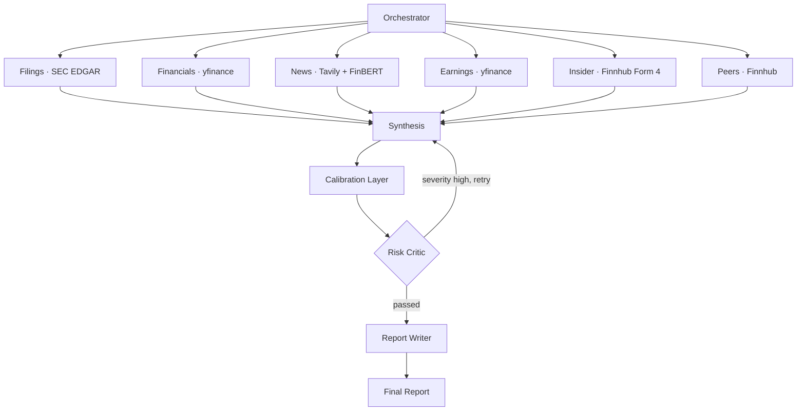

# Argus — Multi-Agent Equity Research

> An AI research analyst that turns a stock ticker into an institutional-style research report — built on six data-gathering agents that work in parallel, a synthesis layer, a deterministic calibration step, and an adversarial risk critic.

Named after **Argus Panoptes**, the hundred-eyed watchman of Greek myth — many eyes watching many sources at once.

**Not a trading bot.** Argus doesn't place trades or chase alpha. It does what a junior research analyst does: gather evidence from filings, financials, news, earnings, insider activity, and peers, then assemble a balanced thesis with a clear recommendation, a confidence score, and an honest critique of its own blind spots.

---

## What it does

Type a ticker (any US-listed equity). In ~60–90 seconds Argus returns:

- **A verdict** — BUY / HOLD / SELL with a confidence score and time horizon
- **Bull and bear cases** — grounded in real numbers from the source data
- **Financial health** — valuation, margins, growth vs. peer averages
- **Recent earnings** — beats/misses with surprise %
- **Insider activity** — 90-day Form 4 buy/sell clustering
- **Competitive positioning** — peer P/E and margin comparison
- **A risk critique** — an adversarial pass that surfaces contradictions, blind spots, and confirmation bias in the thesis

All rendered in a clean dashboard, with the full markdown report available underneath.

---

## Architecture

Argus is orchestrated with **LangGraph**. The core pattern is **fan-out / fan-in**: an orchestrator dispatches six independent sub-agents in parallel, they write to a shared state object, and a synthesis layer collapses their findings into a single thesis. A calibration step and an adversarial critic then refine that thesis before the writer produces the final report.



The risk critic can loop back to synthesis if it finds the thesis too weak (capped at two iterations to prevent runaway loops).

### The six agents

| Agent | Source | What it extracts |
|-------|--------|------------------|
| **Filings** | SEC EDGAR | Business segments, revenue mix, top risk factors from the latest 10-K/10-Q |
| **Financials** | yfinance | Valuation ratios, margins, growth, analyst targets |
| **News** | Tavily + FinBERT | Recent headlines scored for financial sentiment |
| **Earnings** | yfinance | Last four quarters, EPS vs. estimate, surprise % |
| **Insider** | Finnhub (Form 4) | 90-day insider buy/sell clustering |
| **Peers** | Finnhub + yfinance | Sector peers with P/E and margin for relative valuation |

---

## The calibration layer (and why it exists)

The most interesting engineering problem in this project wasn't gathering data — it was correcting a **systematic bias** in the language model.

Running locally on a 7B model (Mistral via Ollama), the synthesis agent had a strong **BUY bias**: it recommended BUY on almost everything, at a reflexive ~70% confidence. In a 20-ticker backtest, **19 of 20** recommendations were BUY. The headline accuracy looked good (75%) — but only because the market happened to be up. The system wasn't actually discriminating between a healthy company and an overvalued one.

The fix is a **hybrid LLM + rules** design: a deterministic calibration layer sits between synthesis and the risk critic. It reads the underlying signals — earnings misses, negative news sentiment, overvaluation vs. peers, insider selling, risk severity — and downgrades the recommendation when enough evidence points the other way. The model handles nuance; the rules enforce discipline.

Getting the thresholds right took real iteration:

| Version | Threshold | Accuracy | Distribution | Outcome |
|---------|-----------|----------|--------------|---------|
| **v1** — no calibrator | — | 75% | BUY 19 / HOLD 1 | Perma-bull; looked good only in an up market |
| **v2 — loose** | 3+ signals | 55% | BUY 13 / HOLD 7 | Over-corrected — false positives downgraded healthy pharma names |
| **v2 — tuned** | 4+ signals | 70% | BUY 17 / HOLD 3 | Balanced; healthcare recovered to 100%, real downgrades kept |

The v2-loose regression was diagnosed by inspecting the per-ticker CSV: four of five healthcare stocks had been wrongly downgraded because a single noisy valuation flag was tripping on the whole sector. Raising the multi-signal threshold from 3 to 4 fixed it — TSLA still correctly drops to HOLD (P/E 369 plus two earnings misses), while JNJ and the other defensives stay BUY.

This tighten → test → diagnose → retune cycle is the kind of work the project is really about.

---

## Backtest results

20 tickers across 4 sectors, scored against 30-day forward returns.

| Sector | Directional Accuracy |
|--------|---------------------|
| Healthcare | 100% (5/5) |
| Finance | 80% (4/5) |
| Consumer | 60% (3/5) |
| Technology | 40% (2/5) |
| **Overall** | **70%** |

**Read this honestly.** The scoring uses a rolling 30-day window measured from the current date, so results shift with market conditions and re-runs are not perfectly reproducible. A point-in-time backtest with frozen historical dates would be more rigorous — it's on the roadmap, and it requires historical news/filings APIs the free tiers don't provide. The number that matters here isn't "70%" in isolation; it's that the system is measured at all, its failure modes are understood, and the path to a cleaner evaluation is mapped.

---

## Tech stack

**Backend** — FastAPI (async), LangGraph for orchestration, Mistral 7B via Ollama (local, free) with a Claude API fallback, FinBERT (`ProsusAI/finbert`) for financial sentiment, Qdrant for vector storage.

**Frontend** — Next.js 15 (App Router) · React 19 · TypeScript · Tailwind CSS · shadcn-style component system · Recharts.

**Data sources** — SEC EDGAR · yfinance · Finnhub · Tavily · all on free tiers.

### Design patterns used

Orchestrator–Worker · Fan-Out/Fan-In (scatter-gather) · Blackboard / shared-state · Critic–Reflection loop · Adapter (one per data source) · Circuit-breaker / graceful degradation · Lazy singleton (model caching) · DTO mapping at the API boundary.

---

## Project structure

```
ai-trading-research-agent/
├── backend/
│   ├── agents/
│   │   ├── orchestrator.py      # plans research, fans out
│   │   ├── synthesis.py         # builds the bull/bear thesis
│   │   ├── calibrator.py        # deterministic bias-correction layer
│   │   ├── risk.py              # adversarial critic + retry loop
│   │   ├── writer.py            # final markdown report
│   │   ├── graph.py             # LangGraph wiring
│   │   └── state.py             # shared ResearchState (blackboard)
│   ├── sub_agents/              # filings, financials, news, earnings, insider, competitor
│   ├── ml/finbert.py            # cached FinBERT sentiment
│   ├── utils/llm.py             # Ollama-first, Claude fallback
│   └── api/main.py              # FastAPI app
├── scripts/backtest_eval.py     # 20-ticker backtest framework
├── argus-web/                   # Next.js frontend
│   ├── app/                     # App Router pages + layout
│   ├── components/              # UI primitives + dashboard pieces
│   └── lib/api.ts               # typed client + response mapper
└── data/reports/                # backtest outputs (CSV / JSON / markdown)
```

---

## Running locally

**Prerequisites:** Python 3.13, Node 18+, [Ollama](https://ollama.com), Docker (for Qdrant).

### 1. Backend

```bash
# install deps
pip install -r requirements.txt

# pull the local model
ollama pull mistral

# create .env from the template and fill in free-tier keys
cp .env.example .env
#   SEC_USER_AGENT, NEWSAPI_KEY, HF_TOKEN, TAVILY_API_KEY, FINNHUB_API_KEY, etc.

# start Qdrant
docker run -p 6333:6333 qdrant/qdrant

# run the API
uvicorn backend.api.main:app --reload
```

You need three processes running: `ollama serve`, Qdrant (Docker), and `uvicorn`.

### 2. Frontend

```bash
cd argus-web
npm install
npm run dev
```

Open **http://localhost:3000**, enter a ticker, and hit Research.

### 3. Backtest (optional)

```bash
python -m scripts.backtest_eval
# writes CSV / JSON / markdown to data/reports/
```

---

## Known limitations

Engineering honesty matters more than a polished demo, so:

- **Price chart is illustrative.** The API doesn't return historical OHLC, so the chart line is a deterministic placeholder. The current price and 1-year change are real; the intraday shape is not.
- **Filings extraction is occasionally noisy.** On some tickers the filings agent grabs XBRL/SIC classification text instead of clean business descriptions. Works reliably on most large caps.
- **Small-model paraphrasing quirks.** Mistral 7B sometimes mislabels a quarter or phrases a sign awkwardly. The numbers are sourced correctly; the prose can wobble. A larger model would clean this up.
- **Backtest is not point-in-time.** Scoring uses a rolling window from today, so it's market-condition-dependent and not fully reproducible.
- **Social sentiment was dropped.** Reddit (OAuth wall) and StockTwits (Cloudflare-blocked) both became inaccessible on free tiers. The system runs on six institutional-grade sources rather than padding with low-signal retail chatter.

---

## Roadmap

- Point-in-time backtest with frozen historical dates
- Response caching to cut repeat-query latency
- Additional sub-agents (analyst ratings, options flow, macro)
- Portfolio mode — rank and compare multiple tickers

---

## Disclaimer

Argus is an educational research project. Its output is **not investment advice**. Nothing here is a recommendation to buy or sell any security.